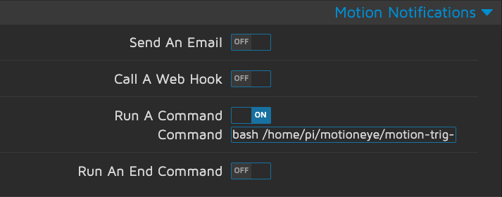

# motioneye
Install and Use motioneye on raspberry pi


## How to use

1. Create .env file
```sh
MESSAGE_TOKEN=<your-token>
SERVER_IP=<your-server-ip>
PORT=<your-port>
```

```sh
$ pip install .
$ send-bot "How are you doing?"
```

### Push message with MotionNotification
with script motion-trig-command.sh
